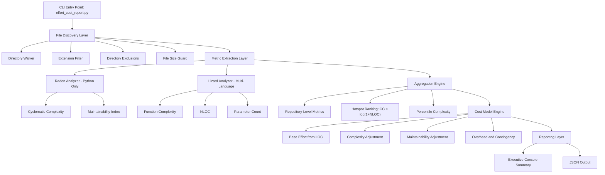

# Effort & Cost Estimation from Code Scanning

A command-line tool that analyzes a source code repository using **Radon** and **Lizard**, then generates an executive-level effort and cost estimation report.

This tool provides a heuristic estimate of development effort and cost using measurable software metrics such as:

- Lines of Code (LOC)

- Cyclomatic Complexity (CC)

- Maintainability Index (MI)

- Function size distribution

- Complexity hotspots
  
  Important: This tool estimates effort using code metrics. It does **not** measure actual human effort. Results are model-based projections.

---

## Features

- Scans multi-language repositories
- Uses **Radon** (Python maintainability + complexity)
- Uses **Lizard** (multi-language complexity analysis)
- Calculates:
  - Average complexity
  - 90th percentile complexity
  - Maintainability index
  - High-risk hotspots
- Produces:
  - Executive summary
  - Effort estimate (hours)
  - Cost estimate (low–high range)
  - Transparent model drivers
- Optional JSON output for automation

---

## Requirements

- Python 3.8+
- Radon
- Lizard

Install dependencies:

```bash
pip install radon lizard
```

Verify installation:

`radon --help lizard --help`

---

## Usage

Basic run:

`python estimate.py /path/to/repository`

With custom hourly rate:

`python estimate.py /path/to/repository --hourly-rate 75 --currency USD`

With exclusions and extensions:

`python estimate.py /path/to/repository \   --include-ext .py .js .java \   --exclude-dir .git node_modules dist build`

Export JSON report:

`python estimate.py /path/to/repository --json-out report.json`

---

## Example Output

```
==============================
EXECUTIVE SUMMARY (ESTIMATED)
==============================
Scanned files:           33
Scanned LOC (non-empty): 2,848

Complexity & Maintainability (proxies):
  Lizard functions:      0
  Lizard avg CC:         n/a
  Lizard p90 CC:         n/a
  Lizard max CC:         n/a
  Python files:          33
  Radon avg MI (Python): 71.82046959080316
  Radon avg CC (Python): 2.6403521825396825

Effort & Cost Estimate:
  Hourly rate:           INR 1,500.00 / hour
  Point estimate hours:  269.79 h
  Range (low–high):      215.83 h  –  323.75 h
  Point estimate cost:   INR 404,687.23
  Range (low–high):      INR 323,749.78  –  INR 485,624.68

Top Hotspots (highest risk score = high complexity × size):
  (none detected)

Model Drivers (transparency):
  - base_hours_from_loc: 142.4
  - overhead_multiplier: 1.6
  - avg_cc_used: 2.64
  - complexity_factor: 1.0
  - avg_mi_used: 71.82
  - maintainability_factor: 1.03
  - contingency_pct: 15.0
  - range_widen_pct: 20

Notes:
  - This is a heuristic estimate from code metrics (LOC/CC/MI). It does not measure true human effort.
  - Radon MI applies only to Python files; for mixed-language repos, MI may be neutral.
  - Cost range is widened when high-complexity hotspots (high CC) are detected.
```

---

## How the Model Works

The estimate is based on:

### 1. Base Effort

`Base Hours = LOC / baseline_loc_per_hour`

Default throughput:

`20 non-empty LOC per hour`

### 2. Overhead Multiplier

Accounts for:

- Code reviews

- Meetings

- Context switching

- QA

- Refactoring

Default:

`1.6 (60% overhead)`

### 3. Complexity Adjustment

If average cyclomatic complexity exceeds reference threshold:

`Complexity Factor = 1 + complexity_k * inflation_ratio`

Default reference CC:

`10`

### 4. Maintainability Adjustment (Python only)

If MI drops below reference:

`Maintainability Factor = 1 + maintainability_k * deficit_ratio`

Default reference MI:

`75`

### 5. Contingency Buffer

Adds uncertainty margin:

`Default: +15%`

### 6. Final Cost

`Cost = Effort Hours × Hourly Rate`

---

## 7. Architecture



## Configuration Options

| Argument                  | Default | Description                   |
| ------------------------- | ------- | ----------------------------- |
| `--hourly-rate`           | 50      | Hourly billing rate           |
| `--currency`              | USD     | Currency label                |
| `--baseline-loc-per-hour` | 20      | Baseline productivity         |
| `--overhead-multiplier`   | 1.6     | Process overhead factor       |
| `--contingency-pct`       | 15      | Risk buffer                   |
| `--complexity-k`          | 0.9     | Complexity impact weight      |
| `--maintainability-k`     | 0.7     | Maintainability impact weight |
| `--ref-avg-cc`            | 10      | Neutral CC threshold          |
| `--ref-mi`                | 75      | Neutral MI threshold          |

---

## Hotspot Detection

The tool ranks high-risk functions using:

`Risk Score = CC × log(1 + NLOC)`

These are areas likely to:

- Require more maintenance effort

- Introduce defects

- Increase future costs

---

## Limitations

- Estimates are heuristic, not contractual

- Radon MI applies only to Python files

- LOC ≠ real human effort

- Does not account for:
  
  - Domain complexity
  
  - Team seniority
  
  - Architectural design decisions
  
  - External integrations

This tool should be used for:

- Executive planning

- Technical due diligence

- Rough-order-of-magnitude cost projection

- Portfolio comparison

Not for:

- Individual developer performance evaluation

- Legal billing validation

- Precise sprint forecasting

---

## Recommended Use Cases

- Codebase valuation during acquisition

- Legacy system modernization estimation

- Refactoring budgeting

- Technical debt assessment

- Pre-project effort modeling

---

## Example Real-World Workflow

1. Run tool on current repository

2. Export JSON report

3. Compare before/after refactoring

4. Use cost delta as ROI indicator

---

## Future Improvements

- Git churn integration

- COCOMO II calibration

- Multi-team scaling model

- Trend analysis over time

- CI integration support

---

# Effort & Cost Estimation from Code Scanning


## License

MIT License (or specify your preferred license)

---

## Disclaimer

This tool provides analytical estimates based on measurable software metrics.  
Actual development effort depends on many non-measurable factors including team experience, architecture quality, business constraints, and domain complexity.
